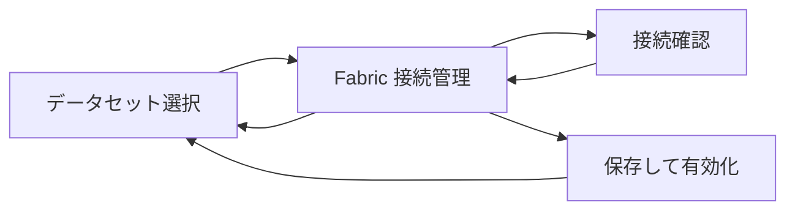

# Fabric 接続管理画面 設計書

## 1. 目的
実 Fabric GraphQL への接続情報を管理者がアプリ画面から登録、疎通確認、有効化できるようにする。従来の `.env` 固定前提をやめ、環境ごと、ワークスペースごとに接続設定を管理できる形にする。

## 2. 画面の役割
- Fabric GraphQL endpoint、Entra ID tenant、client ID、認証方式を登録する。
- Service principal 方式の場合は client secret を登録または差し替える。
- 登録前に Fabric GraphQL endpoint へ疎通確認を実行する。
- 有効な接続設定を1つ選び、データセット選択画面の取得元として使う。
- 接続設定の変更、確認、失敗を監査ログに残す。

## 3. 前後の画面遷移


データセット選択画面の `Fabric に接続` ボタンから本画面へ遷移する。管理画面はワークフローの前提設定であり、分析ステップの進行状態とは独立して常時アクセス可能にする。

## 4. 画面レイアウト案
### 4.1 ヘッダー
- 画面タイトル: `Fabric 接続管理`
- サブテキスト: `Fabric GraphQL endpoint と認証情報を管理します`
- 操作:
  - `再読み込み`
  - `データセットへ戻る`

### 4.2 左カラム: 保存済み接続
- 接続名
- endpoint URL
- ステータス: `未設定 / 接続済み / 確認が必要 / 接続エラー / 確認中`
- 認証方式: `On-behalf-of / Service principal`
- 有効接続バッジ
- 最終疎通成功日時

### 4.3 右カラム: 接続情報フォーム
| 項目 | 必須 | 備考 |
| --- | --- | --- |
| 接続名 | 必須 | 画面表示名 |
| Workspace ID | 任意 | Fabric workspace を固定したい場合に入力 |
| Fabric GraphQL endpoint | 必須 | `https://` で始まる endpoint URL |
| Schema version | 任意 | schema export の管理バージョン |
| 認証方式 | 必須 | `obo` または `service_principal` |
| Tenant ID | 必須 | Entra ID tenant |
| Client ID | 必須 | アプリ登録 client ID |
| Client Secret | 条件付き | Service principal 方式のみ。保存後は再表示しない |

### 4.4 フッター操作
- `接続確認`: 保存前に token 取得と Fabric GraphQL 疎通確認を実行する。
- `保存して有効化`: 接続設定を保存し、データセット選択画面の取得元にする。

## 5. データモデル
```ts
type FabricAuthMode = 'obo' | 'service_principal';
type FabricConnectionStatus =
  | 'unconfigured'
  | 'ready'
  | 'needs_attention'
  | 'error'
  | 'testing';

interface FabricConnectionConfig {
  id: string;
  displayName: string;
  endpointUrl: string;
  tenantId: string;
  clientId: string;
  authMode: FabricAuthMode;
  workspaceId?: string;
  schemaVersion?: string;
  status: FabricConnectionStatus;
  isActive: boolean;
  secretConfigured: boolean;
  lastTestedAt?: string;
  lastSuccessAt?: string;
  lastErrorMessage?: string;
  updatedAt: string;
  updatedBy: string;
}

interface FabricConnectionSecretWrite {
  connectionId: string;
  clientSecret: string;
  rotateExisting: boolean;
}
```

## 6. 保存責務
- `FabricConnectionConfig` はアプリメタデータストアに保存する。
- `clientSecret` は通常のメタデータとして保存せず、Key Vault などの秘密情報ストアへ保存する。
- GraphQL API は `secretConfigured: true/false` のみ画面へ返す。
- 画面に secret の既存値を返さない。差し替え時のみ入力させる。
- 有効な接続設定は原則1件とし、別接続を有効化した場合は既存接続を無効化する。

## 7. GraphQL 入出力案
```graphql
type Query {
  fabricConnectionConfigs: [FabricConnectionConfig!]!
  activeFabricConnection: FabricConnectionConfig
}

type Mutation {
  testFabricConnection(input: FabricConnectionTestInput!): FabricConnectionTestResult!
  saveFabricConnection(input: SaveFabricConnectionInput!): FabricConnectionConfig!
  activateFabricConnection(connectionId: ID!): FabricConnectionConfig!
}

input SaveFabricConnectionInput {
  id: ID
  displayName: String!
  endpointUrl: String!
  tenantId: String!
  clientId: String!
  authMode: FabricAuthMode!
  workspaceId: String
  schemaVersion: String
  clientSecret: String
}

type FabricConnectionTestResult {
  status: FabricConnectionStatus!
  message: String!
  testedAt: DateTime!
  queryTypeName: String
  correlationId: String!
}
```

## 8. 接続確認処理
1. 入力値を検証する。
2. 認証方式に応じて access token を取得する。
3. Fabric GraphQL endpoint に `FabricHealthCheck` または軽量クエリを送信する。
4. Execute 権限、基礎データソース権限、schema取得可否を確認する。
5. 成功時は `ready`、権限不足は `needs_attention`、接続不可は `error` を返す。

```graphql
query FabricHealthCheck {
  __schema {
    queryType {
      name
    }
  }
}
```

本番で introspection を無効化する場合は、管理者が指定した検証用クエリまたは schema export に基づく軽量クエリを使用する。

## 9. 権限
| 操作 | 必要なアプリ権限 |
| --- | --- |
| 接続設定閲覧 | `admin:fabric_connection:read` |
| 接続確認 | `admin:fabric_connection:test` |
| 接続保存 | `admin:fabric_connection:write` |
| 有効化 | `admin:fabric_connection:activate` |
| secret 差し替え | `admin:fabric_connection:secret_write` |

## 10. 実装メモ
- 現行SPAでは `src/components/admin/FabricConnectionAdminScreen.tsx` に管理画面を追加する。
- `src/services/admin/fabricConnectionApi.ts` は現時点ではモックAPIであり、実接続にはバックエンド実装が必要。
- ブラウザから client secret を保持しない。実装時は submit 後にサーバーが秘密情報ストアへ保存し、入力値は即時破棄する。

## 11. 変更履歴
- 2026-04-24: 管理画面から Fabric 接続情報を入力する方針を追加。
