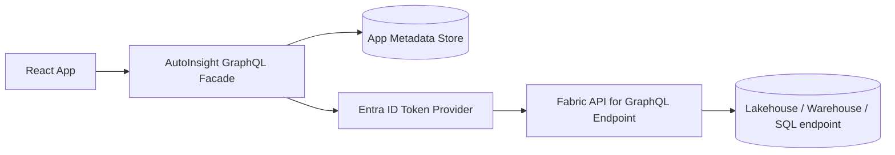

# Microsoft Fabric GraphQL 接続・データスキーマ設計書

## 1. 目的
AutoInsight Segmenter が Microsoft Fabric API for GraphQL に接続し、分析対象データを安全に取得するための接続方式、スキーマ境界、GraphQL型、運用ルールを定義する。

## 2. 前提
- Fabric API for GraphQL は Fabric 上の Lakehouse、Warehouse、SQL database などを GraphQL のデータアクセス層として公開する。
- Fabric 側で GraphQL API item を作成し、公開対象のテーブル、ビュー、ストアドプロシージャを選択すると、Fabric がスキーマとリゾルバを生成する。
- アプリ側は Fabric の業務データ本体を保持せず、Fabric 参照に必要なIDとアプリメタデータのみ保存する。
- 2026-04-24 時点の Microsoft Learn を確認し、Fabric API for GraphQL は Microsoft Entra ID 認証を前提にする。

## 3. 接続アーキテクチャ


初期版ではブラウザから Fabric GraphQL endpoint を直接呼ばず、アプリ側の GraphQL Facade を経由する。理由は、監査ログ、PIIマスク、エラー正規化、アプリメタデータとの結合、将来のジョブ制御をAPI境界で一元化するため。

## 4. 認証・認可
| 項目 | 初期版方針 |
| --- | --- |
| ユーザー認証 | Microsoft Entra ID |
| Fabric API 呼び出し | On-behalf-of または service principal を環境別に選択 |
| OAuth scope | `https://api.fabric.microsoft.com/.default` |
| Fabric権限 | GraphQL API の Execute 権限と、データソースの read/write 権限を確認 |
| アプリ権限 | `dataset:read`, `mapping:write`, `analysis:execute`, `segment:write`, `sample:read` をアプリ内で判定 |
| 監査 | Fabric呼び出し、マッピング保存、分析実行、セグメント出力を `correlationId` 付きで記録 |

SSO方式を採用する場合、ユーザー自身が GraphQL API と基礎データソースの双方にアクセスできる必要がある。Saved credentials 方式を採用する場合、ユーザーは GraphQL API の実行権限を持ち、基礎データソースへの接続は保存済み資格情報に委譲される。同一GraphQL API内では SSO と Saved credentials を混在させない。

## 5. 接続設定の管理方式
初期設計では環境変数を前提にしていたが、実 Fabric 接続では管理者がアプリ画面から接続情報を登録する方式に変更する。管理画面の詳細は `docs/design/fabric-connection-admin-screen.md` に従う。

| 項目 | 管理場所 | 備考 |
| --- | --- | --- |
| Fabric GraphQL endpoint | アプリ管理画面 + メタデータストア | 必須 |
| Entra ID tenant ID | アプリ管理画面 + メタデータストア | 必須 |
| Client ID | アプリ管理画面 + メタデータストア | 必須 |
| Client Secret | アプリ管理画面入力 + 秘密情報ストア | service principal時のみ。画面へ再表示しない |
| 認証方式 | アプリ管理画面 + メタデータストア | `obo` または `service_principal` |
| Schema version | アプリ管理画面 + メタデータストア | 推奨 |

環境変数は、ローカル開発や災害復旧時のフォールバックとしてのみ扱う。本番の有効接続は `FabricConnectionConfig.isActive = true` のレコードから解決する。

## 6. Fabric側公開オブジェクト
分析対象として最低限公開するFabricオブジェクトは以下とする。名称は実データセットごとに異なるため、GraphQL Facade で意味付け済みの内部型へ変換する。

| Fabric側オブジェクト | 必須列 | 用途 |
| --- | --- | --- |
| 顧客マスター | 顧客ID | 分析単位、セグメント出力単位 |
| トランザクションFact | 顧客ID、日時、金額または成果値 | 購買/契約/利用行動の特徴量 |
| イベントログ | 顧客ID、イベント日時、イベント種別 | recency/frequency/count 系特徴量 |
| ディメンション | 外部キー、ラベル | 表示名、カテゴリ特徴量 |
| セグメント出力テーブル | 顧客ID、segmentId、createdAt | 専用テーブル方式での出力 |

## 7. アプリFacadeのGraphQL SDL案
```graphql
scalar DateTime
scalar JSON

type Query {
  fabricWorkspaces(page: PageInput): FabricWorkspaceConnection!
  fabricDatasets(workspaceId: ID, page: PageInput): FabricDatasetConnection!
  fabricDatasetSchema(datasetId: ID!, includeSampleValues: Boolean = false): FabricDataset!
  semanticMappingDraft(datasetId: ID!): SemanticMappingDocument
  analysisInputSummary(mappingDocumentId: ID!): AnalysisInputSummary!
  analysisResult(analysisJobId: ID!): AnalysisResultDocument!
  segmentDraft(analysisJobId: ID!, segmentIds: [ID!]!): SegmentDraft!
}

type Mutation {
  saveSemanticMappingDraft(input: SaveSemanticMappingInput!): SemanticMappingDocument!
  validateSemanticMapping(mappingId: ID!): MappingValidationResult!
  saveAnalysisRunDraft(input: SaveAnalysisRunDraftInput!): AnalysisRunDocument!
  startAnalysis(input: StartAnalysisInput!): StartAnalysisResult!
  saveSegmentDraft(input: SaveSegmentDraftInput!): SegmentDraft!
  previewSegment(input: SegmentPreviewInput!): SegmentPreviewResult!
  createSegmentArtifact(input: CreateSegmentArtifactInput!): SegmentArtifact!
}
```

## 8. Fabricスキーマ取得モデル
```graphql
type FabricWorkspace {
  id: ID!
  name: String!
  region: String
}

type FabricDataset {
  id: ID!
  workspaceId: ID!
  name: String!
  displayName: String!
  lastSyncedAt: DateTime
  tables: [FabricTable!]!
}

type FabricTable {
  id: ID!
  name: String!
  displayName: String!
  rowCount: Int
  description: String
  columns: [FabricColumn!]!
}

type FabricColumn {
  id: ID!
  tableId: ID!
  name: String!
  displayName: String!
  dataType: FabricDataType!
  nullable: Boolean!
  isPrimaryKey: Boolean!
  isForeignKey: Boolean!
  sampleValues: [String!]
  piiCandidate: Boolean
}

enum FabricDataType {
  string
  integer
  float
  boolean
  date
  datetime
  timestamp
  array
  unknown
}
```

## 9. マッピング保存モデル
```graphql
type SemanticMappingDocument {
  id: ID!
  datasetId: ID!
  version: Int!
  status: MappingDocumentStatus!
  tableMappings: [TableSemanticMapping!]!
  columnMappings: [ColumnSemanticMapping!]!
  joinDefinitions: [JoinDefinition!]!
  validationIssues: [ValidationIssue!]!
  createdAt: DateTime!
  updatedAt: DateTime!
  updatedBy: String!
}

enum MappingDocumentStatus {
  draft
  ready
  archived
}

enum SemanticEntityRole {
  customer_master
  transaction_fact
  event_log
  dimension
  excluded
}

enum SemanticColumnRole {
  customer_id
  event_time
  target
  feature
  segment_key
  label
  excluded
}
```

## 10. 分析・結果モデル
```graphql
type AnalysisRunDocument {
  id: ID!
  datasetId: ID!
  mappingDocumentId: ID!
  mode: AnalysisMode!
  config: JSON!
  configHash: String!
  status: AnalysisJobStatus!
  estimatedDurationSeconds: Int
  modelVersion: String
  featureGenerationVersion: String
  randomSeed: Int
  createdAt: DateTime!
  createdBy: String!
}

type AnalysisResultDocument {
  analysisJobId: ID!
  runId: ID!
  datasetId: ID!
  mappingDocumentId: ID!
  mode: AnalysisMode!
  status: AnalysisJobStatus!
  progressPercent: Int!
  message: String!
  summary: AnalysisResultSummary!
  featureImportances: [FeatureImportanceResult!]!
  interactionPairs: [FeatureInteractionResult!]!
  goldenPatterns: [GoldenPatternResult!]!
  segmentRecommendations: [SegmentRecommendation!]!
}
```

## 11. 接続時の処理順
1. アプリ起動時にユーザーを Entra ID で認証する。
2. GraphQL Facade がユーザーまたは service principal の Fabric access token を取得する。
3. `fabricWorkspaces` でアクセス可能なワークスペースを取得する。
4. `fabricDatasets` で公開済み GraphQL API と対応するデータセット候補を取得する。
5. ユーザーが `Fabric に接続` を押したら、管理画面の有効接続設定に紐づく endpoint へ疎通確認クエリを送る。
6. `fabricDatasetSchema` でテーブル一覧とカラムメタデータを取得する。
7. Query フィールドの戻り値に `totalCount` が公開されている場合は、`first: 1` 相当の軽量クエリでテーブルごとの行数目安を取得する。
8. `totalCount` が公開されていない場合は、`items / endCursor / hasNextPage` と `first / after` によるページングで、必要最小限の1列だけを取得しながら行数目安を取得する。
9. サンプル値は `sample:read` 権限がある場合のみ取得し、PII候補はマスクする。

## 12. 疎通確認クエリ案
実Fabricスキーマはデータソースごとに異なるため、初期疎通は introspection または軽量な公開テーブルの `first: 1` 相当クエリで確認する。

```graphql
query FabricHealthCheck {
  __schema {
    queryType {
      name
    }
  }
}
```

## 13. 行数取得クエリ案
Fabric GraphQL の公開スキーマが connection 型に `totalCount` を持つ場合は、まず `totalCount` を利用する。`totalCount` がない場合は、`items / endCursor / hasNextPage` によるページングで行数を数える。必須引数を補えないテーブルは未取得扱いにする。

```graphql
query FabricRowCounts {
  accounts(first: 1) {
    totalCount
  }
  appointments(first: 1) {
    totalCount
  }
}
```

`totalCount` がない場合のフォールバック例:

```graphql
query FabricRowCountPage {
  accounts(first: 1000, after: "<cursor>") {
    items {
      id
    }
    endCursor
    hasNextPage
  }
}
```

本番運用では introspection を無効化する可能性があるため、Fabric schema export をCIで取得し、アプリ側の契約テストに使う。

## 14. スキーマ運用
- Fabric の schema export をリポジトリまたは成果物ストレージでバージョン管理する。
- 追加フィールドは後方互換として許容する。
- 削除、リネーム、型変更は破壊的変更として検出し、対象画面のクエリを更新するまでリリースを止める。
- Facade API の `FabricDataType` へ変換できない型は `unknown` とし、分析対象から除外する。

## 15. 参照元
- Microsoft Learn: https://learn.microsoft.com/en-us/fabric/data-engineering/api-graphql-overview
- Microsoft Learn: https://learn.microsoft.com/en-us/fabric/data-engineering/get-started-api-graphql
- Microsoft Learn: https://learn.microsoft.com/en-us/fabric/data-engineering/api-graphql-introspection-schema-export
- Microsoft Learn: https://learn.microsoft.com/en-us/fabric/data-engineering/api-graphql-service-principal

## 16. 変更履歴
- 2026-04-26: 実接続時の `totalCount` およびページングによる行数取得方針を追記。
- 2026-04-24: Fabric 接続情報を管理画面で入力・保存する方式に更新。
- 2026-04-24: `/design` 成果物として Fabric GraphQL 接続とデータスキーマを追加。
