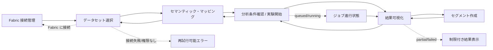

# 画面遷移図・UIコンポーネント横断設計書

## 1. 目的
`/design` コマンドの成果物として、AutoInsight Segmenter の主要画面遷移と各画面のUIコンポーネント責務を横断的に定義する。詳細な画面別仕様は既存の画面設計書に委譲し、本書では実装時に迷いやすいナビゲーション、共通コンポーネント、画面間データ受け渡しを整理する。

## 2. 画面遷移図

## 3. 画面別の主コンポーネント
| 画面 | 主コンポーネント | 役割 | 入力 | 出力 |
| --- | --- | --- | --- | --- |
| Fabric 接続管理 | `FabricConnectionAdminScreen` | Fabric GraphQL endpoint と認証情報の登録・確認 | 管理者入力 | `FabricConnectionConfig` |
| データセット選択 | `DatasetSelectionScreen` | Fabric ワークスペースとデータセットの選択 | 認証済みユーザー | `SelectedDatasetContext` |
| セマンティック・マッピング | `MappingScreen` | テーブル/カラムに業務意味を付与 | `datasetId` | `SemanticMappingDocument` |
| 分析条件確認 | `AnalysisRunScreen` | 分析モードと実行条件を確定 | `mappingDocumentId` | `analysisJobId` |
| 結果可視化 | `ResultsVisualizationScreen` | 重要要因、パターン、候補セグメントを確認 | `analysisJobId` | `SelectedSegmentContext` |
| セグメント作成 | `SegmentCreationScreen` | 条件編集、件数確認、保存/出力 | `analysisJobId`, `segmentIds` | `SegmentArtifact` |

## 4. 共通UIコンポーネント方針
| コンポーネント | 使用箇所 | 設計方針 |
| --- | --- | --- |
| `Shell` | 全画面 | 現在ステップ、完了済みステップ、戻り導線を表示する。URL復元時もIDから現在ステップを判定する。 |
| `Button` | 全画面 | 主要操作は1画面1つに絞る。保存、検証、実行、作成など状態変更を伴う操作はローディングと二重送信防止を持つ。 |
| `EmptyState` | 初期ロード/空データ | Fabric接続中、権限なし、対象なし、結果未生成を文言で分ける。 |
| `ValidationIssueList` | マッピング/分析/セグメント | `ValidationIssue` を severity と blocking で並べ、ユーザーが直せる項目に `suggestedAction` を表示する。 |
| `StatusBanner` | 接続/ジョブ/結果 | `retryable`、`correlationId`、部分結果の有無を表示する。 |
| `Metric` | 分析/結果 | 技術指標をそのまま出さず、対象件数、改善幅、信頼度など業務語彙に変換する。 |

## 5. URLと状態復元
画面遷移時は永続IDのみURLに保持し、表示詳細はGraphQL APIから再取得する。ルーティング state は表示高速化の補助に限定する。

| 画面 | URL例 | 復元に使うID |
| --- | --- | --- |
| Fabric 接続管理 | `/admin/fabric-connections` | なし、または `connectionId` |
| データセット選択 | `/datasets` | なし |
| セマンティック・マッピング | `/mapping?datasetId=ds_001` | `datasetId` |
| 分析条件確認 | `/analysis?mappingDocumentId=map_001` | `mappingDocumentId` |
| 結果可視化 | `/results?analysisJobId=job_001` | `analysisJobId` |
| セグメント作成 | `/segments?analysisJobId=job_001&segmentIds=seg_a,seg_b` | `analysisJobId`, `segmentIds` |

## 6. 画面別エラー状態
| 画面 | 主なエラー | UI挙動 |
| --- | --- | --- |
| データセット選択 | Fabric接続失敗、権限不足、ワークスペースなし | 再試行ボタン、権限申請導線、空状態を出し分ける。 |
| マッピング | スキーマ取得失敗、サンプル値閲覧不可、必須ロール不足 | エラー対象テーブル/列をハイライトし、保存は許可、次画面遷移は blocking error で不可。 |
| 分析条件確認 | 目的変数不備、対象期間不備、重複ジョブ | 設定修正、既存ジョブ遷移、再検証を提示する。 |
| 結果可視化 | partial、failed、権限変更 | 部分結果は暫定バッジを表示し、セグメント作成など確定操作を制限する。 |
| セグメント作成 | 件数プレビュー失敗、出力権限なし、保存競合 | プレビュー再計算、出力方法の無効化、version 再読み込みを行う。 |

## 7. 関連設計書
- `docs/design/dataset-selection-screen.md`
- `docs/design/fabric-connection-admin-screen.md`
- `docs/design/semantic-mapping-screen.md`
- `docs/design/analysis-run-screen.md`
- `docs/design/results-visualization-screen.md`
- `docs/design/segment-creation-screen.md`
- `docs/design/navigation-context.md`
- `docs/design/graphql-contract.md`

## 8. 変更履歴
- 2026-04-24: `/design` 成果物として画面遷移図とUIコンポーネント横断設計を追加。
